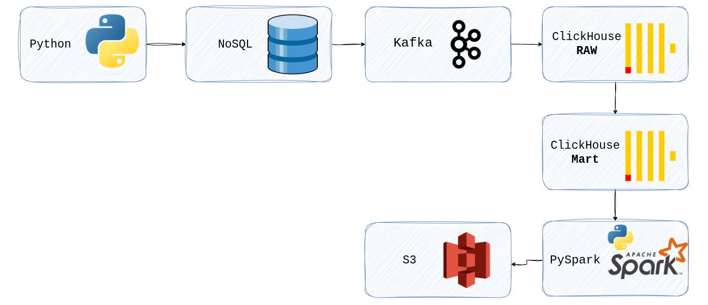
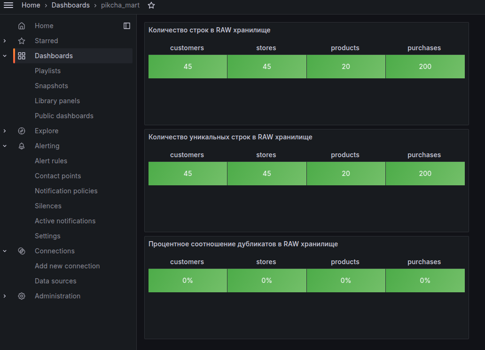
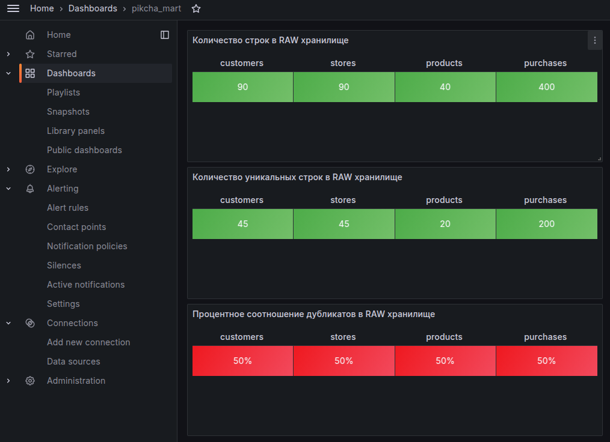
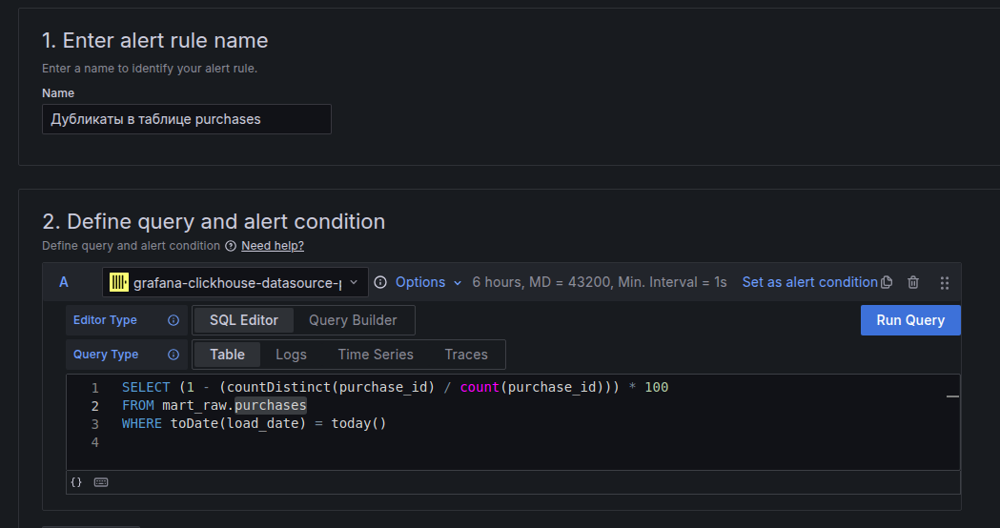
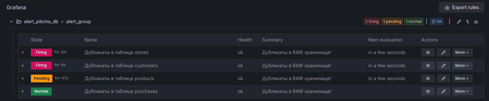
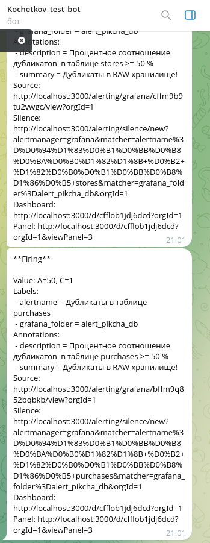
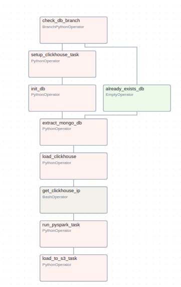
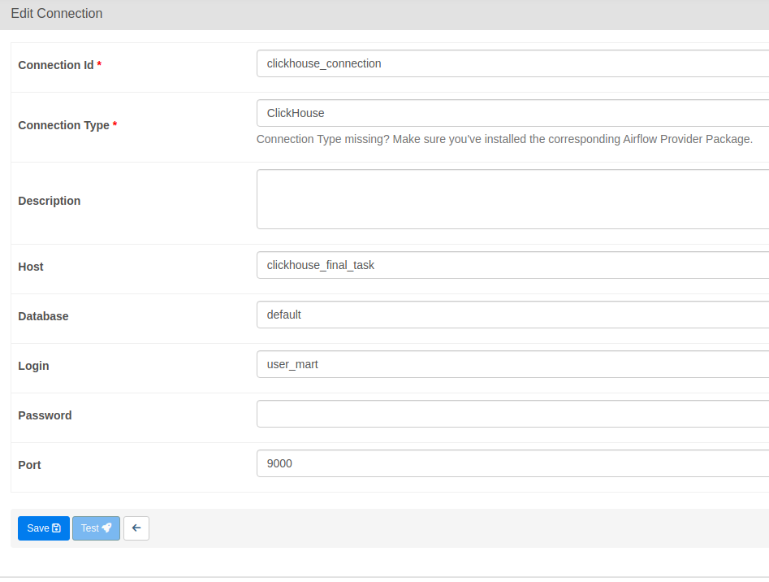
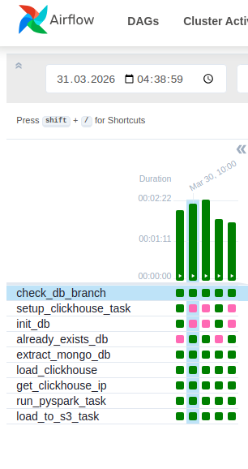
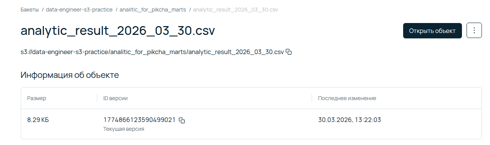

## Проект аналитической системы для сети магазинов "Пикча"


### Содержание
- [Описание проекта](#описание-проекта)
- [Реализация](#реализация)
- [Подготовка окружения](#подготовка-окружения)
- [Генерация синтетических данных](#генерация-синтетических-данных)
- [Загрузка данных в MongoDB](#загрузка-данных-в-mongodb)
- [Ручной запуск проекта](#ручной-запуск-проекта)
- [Дашборды и алертинг в Grafana](#дашборды-и-алертинг-в-grafana)
- [Автоматический запуск проекта](#автоматический-запуск-проекта)
- [Граф выполнения пайплана](#граф-выполнения-пайплана)
- [Результат](#результат)


### Описание проекта
Демоверсия аналитической системы для сети магазинов "Пикча"



* Генерация синтетических данных
* Загрузка данных в NoSQL хранилище
* При помощи Kafka загрузка данных в RAW (сырое) хранилище
* Шифрование персональных данных
* В Grafana реализован алертинг дубликатов в исходных таблицах
* Очистка и перенос данных при помощи MV из RAW слоя в MART слой
* ETL процесс на PySpark для создания витрин
* Загрузка результата в S3 хранилище
* Аркестрация в Airflow

### Реализация
#### Подготовка окружения

* Склонировать проект 

```git clone https://github.com/KochetkovK/pikcha_marts_analitics.git```

*  Создать и активировать виртуальное окружение
```
python3 -m venv .venv
source .venv/bin/activate 
```
* Установить зависимости

```pip install -r requirements.txt```

* Создать и заполнить файл .env по образцу env.example

* Собрать Airflow

```docker build -t airflow-with-java .```

* Запустить

```docker compose up -d```

#### Генерация синтетических данных

* Запустить файл [modules/generator_data.py](modules/generator_data.py)

```python3 modules/generator_data.py```

#### Загрузка данных в MongoDB

* Запустить файл [modules/insert_into_mongo.py](modules/insert_into_mongo.py)

```python3 modules/insert_into_mongo.py```

#### Ручной запуск проекта
* Подключится к ClickHouse
* Запустить sql-файл [mart_clickhouse.sql](mart_clickhouse.sql)
* Запустить файл [modules/producer.py](modules/producer.py)

```python3 modules/producer.py```

* Запустить файл [modules/consumer_to_clickhouse.py](modules/consumer_to_clickhouse.py)

```python3 modules/consumer_to_clickhouse.py```

* Открыть в Jupyter Notebook файл [modules/spark_etl.ipynb](modules/spark_etl.ipynb)
* Запустить последовательно все ячейки

#### Дашборды и алертинг в Grafana








#### Автоматический запуск проекта

##### Граф выполнения пайплана



* **Данные в NOSQL хранилище должны быть**
* Таблицы в ClickHouse не обязательно, DAG проверит наличие и если их нет, то создаст

* Создать подключение к ClickHouse в Airflow


* Запустить DAG [dags/etl_dag.py](dags/etl_dag.py) из веб-интерфейса airflow

#### Результат




